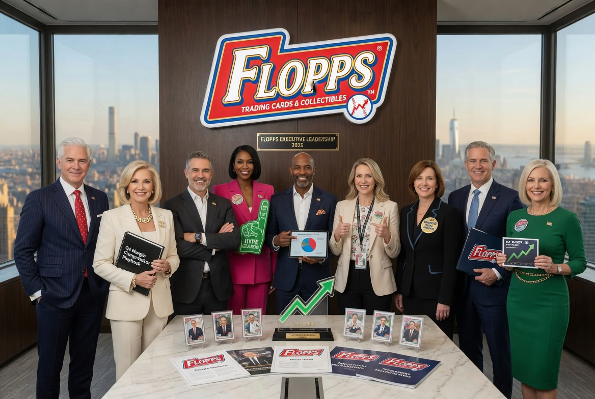

# Trading Cards Skill for OpenClaw

Trading Cards Skill for OpenClaw drops you into an alternate universe where trading cards are the only currency that matters. Cards are not collectibles here. They are capital, status, rumor, leverage, and worship. The market has depth, the packs have heat, the specs have lore, and the company behind it all, Flopps, is the world's most influential end-stage capitalism machine, controlling the one true asset class: cardstock gold.

<!-- markdownlint-disable MD033 -->
<p align="center">
  
</p>
<!-- markdownlint-enable MD033 -->

This skill is built for collectors and breakers who want the fantasy to feel real. It treats a virtual hobby like a living market: sealed product, chase tiers, grading pressure, resale spread, social hype, speculative liquidity, and the long emotional arc of chasing one more hit. The joke is that it is all fake. The joke also has a ledger.

This repo is the public mirror of the skill. It bundles the runtime scripts, reference notes, and seeded simulation data needed to inspect, install, and extend the skill as a real OpenClaw package.

## What It Does

The skill is built for the full lifecycle of virtual trading cards, from concept to collection to market noise.

- Generate procedural card sets with themed categories, sizes, and rarity curves
- Generate AI-assisted sets through OpenRouter
- Model sports, celebrity, movie, TV, collection, novelty, and custom set types
- Build modular prompt payloads for front, back, or both sides of a card
- Open retail, blaster, hobby, and jumbo packs or boxes
- Track wallet balance, portfolio value, duplicates, sealed inventory, and hits
- Simulate grading, resale, market drift, and condition-sensitive valuation
- Produce Flopps bulletins, launch copy, investor-facing nonsense, and wildcard events
- Generate release metadata, prompt bundles, and downstream export data
- Preserve a reproducible hobby economy rather than a one-off prompt toy

## Why It Exists

Most card tools stop at "make a set." This one keeps going. It behaves like a collector, a breaker, a market maker, a grader, and a fake corporate newsroom all at once. That makes it useful for testing workflows, building content, and stress-testing the economics of a hobby that is already half game, half spreadsheet, and half ritual. The math does not add up. The simulation does. The obsession does.

## Core Skill Commands

These are the primary user-facing commands the skill expects you to use inside OpenClaw.

| Command | Purpose |
| --- | --- |
| `generate-set` | Build a procedural card set |
| `generate-set-ai` | Build an AI-assisted card set through OpenRouter |
| `open-pack <type>` | Open a retail, blaster, hobby, or jumbo pack |
| `open-box <type>` | Open a sealed box of packs |
| `portfolio` | Show collection value, wallet, and portfolio stats |
| `wallet` | Show current cash balance and spending context |
| `market` | Show the live market dashboard |
| `market <card-num>` | Inspect a specific card’s market view |
| `duplicates` | Find duplicate cards in the collection |
| `top-cards` | Show the best cards owned |
| `pack-stats` | Show pack-opening statistics |
| `set-info` | Display set details and custom structure |
| `card-types` | Display the type system for the current set |
| `new-season` | Advance to the next season or set cycle |
| `grade-card <card-num>` | Submit a card for grading |
| `sell <card-num>` | Sell a card from the collection |
| `buy <card-num>` | Buy from the market |
| `flopps-status` | Show the current Flopps state and latest bulletin |
| `flopps-day <day>` | Summarize Flopps activity on a specific simulation day |
| `flopps-today` | Summarize the current simulation day |
| `flopps-wildcard` | Force a surprise Flopps event |

Use `openclaw skills list` after installation to confirm the skill is loaded.

## Script Commands

The repo includes the underlying scripts used by the skill. These are what the command surface is built on.

| Script | Purpose |
| --- | --- |
| `scripts/card-engine.js` | Main simulation engine, pack opening, market logic, Flopps status, collection state |
| `scripts/ai-set-generator.js` | OpenRouter-backed AI set generation and Flopps launch content |
| `scripts/card-image-prompts.js` | Build structured front/back image prompt bundles for cards |
| `scripts/card-image-system.js` | Prompt synthesis helpers and set prompt persistence |
| `scripts/categories.js` | Category definitions and category-aware generation logic |
| `scripts/set-metadata.js` | Set metadata helpers used by generators and prompt builders |
| `scripts/generate-prompts.js` | Prompt generation utilities for card and set text |
| `scripts/boc-set-generator.js` | Bake and generate the BOC set snapshot |
| `scripts/test-flopps-simulation.js` | Regression suite for Flopps simulation behavior |
| `scripts/test-flopps-simulation.sh` | Shell regression wrapper for Flopps simulation behavior |
| `scripts/test-sell-dupes-regression.js` | Regression coverage for duplicate-selling flow |

## Feature Highlights

- **Pack economy** - hobby, blaster, retail, and jumbo flows with wallet checks and real-mode commits
- **Collection engine** - owned cards, sealed inventory, duplicates, hits, and portfolio summaries
- **Market simulation** - valuation drift, order books, marketplace behavior, and resale pressure
- **Grading layer** - condition, grading companies, and value-sensitive fees
- **Flopps newsroom** - parody company updates, wildcard events, and day-by-day summaries
- **Prompt tooling** - image prompt synthesis for front, back, or both sides of a card
- **Set design** - procedural and AI-assisted generation across multiple card categories
- **Repeatable state** - seeded data and reference files for reproducible runs

## OpenClaw Install

Install without prompts from a known skill slug:

```bash
openclaw skills install trading-cards
openclaw skills list
```

Install from a local checkout:

```bash
cd /path/to/Trading-Cards-Skill-for-OpenClaw
openclaw skills install .
openclaw skills list
```

OpenClaw loads workspace skills on the next session. If you want the skill available immediately, start a new OpenClaw session or restart the gateway.

## Repository Layout

- `SKILL.md` - OpenClaw skill definition and operating rules
- `scripts/` - runtime commands used by the skill
- `references/` - design and behavior references for the simulation
- `data/` - seed data and state snapshots
- `CHANGELOG.md` - release history
- `LICENSE.md` - MIT license

## How To Use It

Think of the skill as a trading-card operating system.

1. Generate a set or load an existing one.
2. Open packs and watch the market react.
3. Track wallet, hits, duplicates, and portfolio drift.
4. Grade, sell, buy, and relist cards like a serious collector.
5. Trigger Flopps events when you want the fake corporate machine to speak.

If the fantasy is working, the collection should feel valuable even when the cards are fictional. That is the point.

## Public Status

This repository is a public mirror for the skill content. It is not an official OpenClaw project and does not imply endorsement by OpenClaw maintainers.

## License

MIT. See [LICENSE.md](LICENSE.md).
